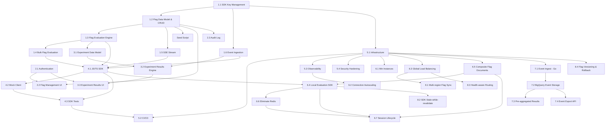

# MystWeaver Engineering Roadmap

This document defines the complete engineering roadmap for MystWeaver, sequenced so that [Room 404](https://github.com/PGRBRyant/room-404) (a multiplayer browser game) can consume MystWeaver as its feature flag and experimentation backend.

**Target scale:** 500+ concurrent Room 404 players, primarily US-based with global reach.
**Platform:** GCP-native (all services on Google Cloud Platform).
**Languages:** TypeScript (API, SDK, admin UI), Go (event pipeline), Rust (WASM evaluation core — future).
**Cost model:** Near-zero idle cost between game sessions; pay only during active play.

---

## Room 404 Integration Readiness

Use this checklist to determine what Room 404 can do at any point:

### (a) Room 404 can start building against MystWeaver

All of Phase 1 must be complete:

- [x] **1.1** SDK Key Management — create, list, revoke, validate
- [x] **1.2** Flag Data Model & CRUD — multi-project Firestore schema, full REST API
- [x] **1.3** Flag Evaluation Engine — single flag evaluation via `POST /sdk/evaluate`
- [x] **1.4** Bulk Flag Evaluation — `POST /sdk/evaluate/bulk` (up to 50 flags)
- [x] **1.5** Server-Sent Events Stream — `GET /sdk/stream` for real-time updates
- [x] **1.6** Event Ingestion — `POST /sdk/events` for metrics and experiment data
- [x] **Seed** — `npm run seed` populates all Room 404 flags into local emulator

### (b) Room 404 can run integration tests

Phase 1 + Phase 4 must be complete:

- [x] **4.1** JavaScript/TypeScript SDK published (`@mystweaver/sdk`)
- [x] **4.2** Mock Client available (`@mystweaver/sdk/mock`)
- [x] **4.3** SDK test suite passing (Node + browser)

### (c) Live demo ready

Phases 1–5 complete:

- [x] **Phase 2** — Admin UI with auth, flag management, audit log
- [x] **Phase 3** — Experimentation engine with live results UI
- [ ] **Phase 5** — Production infrastructure, CI/CD, observability, security

### (d) Room 404 can handle 500+ concurrent players at near-zero idle cost

Phases 6–7 complete:

- [ ] **6.4** — Local evaluation in SDK (zero-latency flag checks)
- [ ] **6.6** — Redis eliminated (no always-on infrastructure)
- [ ] **6.7** — Session lifecycle (scale to zero between sessions, ~$0.02/mo idle)
- [ ] **Phase 7** — Event pipeline (Go ingestion service, BigQuery analytics)

---

## Dependency Graph



---

## Phase 1: Foundation

> **Goal**: Build every backend endpoint Room 404 needs to function. After Phase 1, any client can evaluate flags, stream updates, and send events using raw HTTP.

### 1.1 SDK Key Management

|                  |                                                      |
| ---------------- | ---------------------------------------------------- |
| **Goal**         | Secure, scoped API key system for SDK authentication |
| **Complexity**   | M                                                    |
| **Dependencies** | None (first milestone)                               |

**Deliverables:**

- `POST /api/sdk-keys` — create a named SDK key scoped to a project. Returns the raw key exactly once. Key is stored hashed (bcrypt) in Firestore at `sdk-keys/{keyId}`.
- `GET /api/sdk-keys` — list all keys for the authenticated project. Returns metadata only: `id`, `name`, `projectId`, `createdAt`, `lastUsedAt`, `revokedAt`. Never returns raw key values.
- `DELETE /api/sdk-keys/:id` — revoke a key immediately. Sets `revokedAt` timestamp; key becomes permanently invalid.
- `validateSDKKey` middleware — reads `Authorization: Bearer <key>` header, hashes incoming key, matches against Firestore. Attaches `projectId` to `req.context`. Returns 401 for missing, invalid, or revoked keys.

**Definition of done:**

- [x] Key creation returns raw key exactly once; subsequent GETs never expose it
- [x] Key is stored hashed (SHA-256); raw value is unrecoverable from Firestore
- [x] Revoked key returns 401 immediately on next request
- [x] Invalid/missing key returns 401
- [x] Valid key attaches correct `projectId` to request context
- [x] All tests passing

---

### 1.2 Flag Data Model & CRUD

|                  |                                               |
| ---------------- | --------------------------------------------- |
| **Goal**         | Multi-project flag storage with full REST API |
| **Complexity**   | L                                             |
| **Dependencies** | 1.1 (SDK key provides projectId scoping)      |

**Firestore schema:**

```
projects/{projectId}/flags/{flagKey}
  key: string
  name: string
  description: string
  type: 'boolean' | 'number' | 'string' | 'json'
  defaultValue: unknown
  enabled: boolean
  rules: TargetingRule[]
  tags: string[]
  deletedAt?: timestamp          // soft delete
  createdAt: timestamp
  updatedAt: timestamp
  createdBy: string
```

**TargetingRule:**

```
  id: string
  description: string
  conditions: Condition[]        // AND logic within a rule
  value: unknown                 // value returned if rule matches
  rolloutPercentage?: number     // 0-100 for gradual rollouts
```

**Condition:**

```
  attribute: string              // e.g. "skillTier", "percentileRank"
  operator: 'eq' | 'neq' | 'gt' | 'lt' | 'gte' | 'lte' | 'in' | 'contains'
  value: unknown
```

**Deliverables:**

- `POST /api/flags` — create flag (key must be unique per project, returns 409 on collision)
- `GET /api/flags` — list all flags for project (excludes soft-deleted)
- `GET /api/flags/:key` — get single flag
- `PUT /api/flags/:key` — full update (replaces entire document)
- `PATCH /api/flags/:key` — partial update (toggle enabled, update single field)
- `DELETE /api/flags/:key` — soft delete (sets `deletedAt`, hidden from evaluation)

**Definition of done:**

- [x] CRUD operations persist correctly to Firestore under `projects/{projectId}/flags/`
- [x] Flag key unique per project; collision returns 409
- [x] Type validation: value must match declared `type`
- [x] Soft delete hides flag from evaluation but retains audit record
- [x] Invalid flag key format returns 400
- [x] All tests passing

---

### 1.3 Flag Evaluation Engine (Single)

|                  |                                                 |
| ---------------- | ----------------------------------------------- |
| **Goal**         | Evaluate a single flag for a given user context |
| **Complexity**   | L                                               |
| **Dependencies** | 1.2 (needs flag data model)                     |

**Endpoint:** `POST /sdk/evaluate`
**Auth:** `Authorization: Bearer <sdk-key>`

**Request:**

```json
{
  "flagKey": "game.task-timer-seconds",
  "userContext": {
    "id": "plr_7f3k9x",
    "attributes": {
      "skillTier": "struggling",
      "percentileRank": 0.1,
      "deviceType": "mobile"
    }
  }
}
```

**Response:**

```json
{
  "flagKey": "game.task-timer-seconds",
  "value": 12,
  "type": "number",
  "reason": "rule:skill-tier-struggling",
  "ruleId": "rule_abc123",
  "enabled": true,
  "evaluatedAt": 1710000000
}
```

**Evaluation logic (in order):**

1. Flag does not exist -> `{ value: null, reason: "flag_not_found" }`
2. Flag disabled -> `{ value: defaultValue, reason: "flag_disabled" }`
3. Evaluate rules top-to-bottom, first match wins
4. Within a rule, ALL conditions must match (AND logic)
5. If rule has `rolloutPercentage`, hash `userId + flagKey` -> deterministic bucket
6. No rules match -> `{ value: defaultValue, reason: "default" }`

**Definition of done:**

- [x] Disabled flag always returns default with `reason: "flag_disabled"`
- [x] Rule targeting by exact attribute match
- [x] Rule targeting by numeric comparison (`gt`, `lt`, `gte`, `lte`)
- [x] Rule targeting by array membership (`in` operator)
- [x] Rules evaluated in order; first match wins
- [x] Percentage rollout is deterministic (same user always gets same value)
- [x] Percentage rollout distribution is statistically correct (+/- 2%)
- [x] Missing flag returns null with `reason: "flag_not_found"`
- [x] Wrong SDK key returns 401
- [x] Malformed request returns 400 with clear error
- [x] All tests passing

---

### 1.4 Bulk Flag Evaluation

|                  |                                             |
| ---------------- | ------------------------------------------- |
| **Goal**         | Evaluate up to 50 flags in a single request |
| **Complexity**   | M                                           |
| **Dependencies** | 1.3 (builds on single evaluation)           |

**Endpoint:** `POST /sdk/evaluate/bulk`
**Auth:** `Authorization: Bearer <sdk-key>`

**Request:**

```json
{
  "flags": ["game.task-timer-seconds", "powerups.jetpack-enabled"],
  "userContext": { "id": "plr_7f3k9x", "attributes": { ... } }
}
```

**Response:**

```json
{
  "flags": {
    "game.task-timer-seconds": { "value": 8, "reason": "default", "enabled": true },
    "powerups.jetpack-enabled": { "value": true, "reason": "rule:all-users", "enabled": true }
  },
  "evaluatedAt": 1710000000,
  "durationMs": 4
}
```

**Requirements:**

- All flags evaluated in parallel (`Promise.all`)
- Max 50 flags per request (return 400 if exceeded)
- Unknown flag keys return null value, not an error
- Single Firestore read per unique flag key
- Response time target: < 100ms for 20 flags

**Definition of done:**

- [x] All flags evaluated and returned
- [x] Unknown flag keys return null gracefully
- [x] > 50 flags returns 400
- [x] Parallel evaluation verified (concurrent Firestore reads)
- [x] Response includes `durationMs`
- [x] Empty flags array returns empty object, not error
- [x] All tests passing

---

### 1.5 Server-Sent Events Stream

|                  |                                                        |
| ---------------- | ------------------------------------------------------ |
| **Goal**         | Real-time flag updates pushed to connected SDK clients |
| **Complexity**   | L                                                      |
| **Dependencies** | 1.2 (needs flag data to stream)                        |

**Endpoint:** `GET /sdk/stream`
**Auth:** `Authorization: Bearer <sdk-key>`
**Response content-type:** `text/event-stream`

**Behavior:**

- On connect: send all current flag values as a `snapshot` event
- On any flag change: send `flag.updated` event within 500ms
- Keepalive `ping` every 30 seconds
- On disconnect: clean up Firestore `onSnapshot` listener (no memory leak)

**Event formats:**

```
data: {"type":"snapshot","flags":{"flagKey":{"value":...},...}}

data: {"type":"flag.updated","flagKey":"game.task-timer-seconds","value":5,"previousValue":8,"updatedAt":1710000000}

data: {"type":"ping"}
```

**Monitoring endpoint:** `GET /api/stream/connections` — returns count of active SSE connections.

**Definition of done:**

- [x] Snapshot sent on connection containing all current flags
- [x] Flag update triggers event within 500ms
- [x] Ping sent every 30 seconds
- [x] Disconnect cleans up Firestore listener (no memory leak)
- [x] Multiple concurrent connections all receive updates
- [x] Wrong SDK key returns 401 before stream opens
- [ ] All tests passing

---

### 1.6 Event Ingestion

|                  |                                                                   |
| ---------------- | ----------------------------------------------------------------- |
| **Goal**         | Accept evaluation and metric events from SDKs for experimentation |
| **Complexity**   | M                                                                 |
| **Dependencies** | 1.1 (needs SDK key validation)                                    |

**Endpoint:** `POST /sdk/events`
**Auth:** `Authorization: Bearer <sdk-key>`

**Request:**

```json
{
  "events": [
    {
      "type": "flag.evaluated",
      "flagKey": "game.task-timer-seconds",
      "userId": "plr_7f3k9x",
      "value": 8,
      "timestamp": 1710000000
    },
    {
      "type": "metric.tracked",
      "event": "room.completed",
      "userId": "plr_7f3k9x",
      "properties": { "roomType": "leak", "floor": 7 },
      "timestamp": 1710000001
    }
  ]
}
```

**Response:** `{ "accepted": 2, "dropped": 0 }`

**Requirements:**

- Always return 200 (fire-and-forget contract)
- Max 100 events per batch; excess silently dropped with count in `dropped`
- Write to Firestore async (do not await in request handler)
- Events stored at `projects/{projectId}/events/{eventId}`

**Definition of done:**

- [x] Valid events return 200 with correct accepted count
- [x] Endpoint returns immediately (< 50ms), does not wait for Firestore write
- [x] Events written correctly to Firestore (async assertion)
- [x] > 100 events: first 100 accepted, rest dropped, counts correct
- [x] Malformed events drop gracefully without crashing
- [x] All tests passing

---

### Seed Script

|                  |                                                           |
| ---------------- | --------------------------------------------------------- |
| **Goal**         | Populate local Firestore emulator with all Room 404 flags |
| **Complexity**   | S                                                         |
| **Dependencies** | 1.2 (needs flag data model)                               |

**Deliverable:** `scripts/seed-flags.ts`, runnable via `npm run seed`

- Seeds all Room 404 flags (boolean, number, string, JSON) into the emulator
- Creates one test SDK key, prints raw value to stdout
- Creates two experiment definitions
- Idempotent (safe to run multiple times)

**Definition of done:**

- [x] `npm run seed` creates all 24 Room 404 flags
- [x] SDK key created and printed to stdout
- [x] Two experiment definitions seeded
- [x] Idempotent (safe to run multiple times)
- [x] `deletedAt: null` set explicitly (Firestore null-query compatibility)

---

## Phase 2: Admin Interface

> **Goal**: Web UI for managing flags, viewing audit history, and operating MystWeaver. Required for the live demo but not for Room 404 SDK integration.

### 2.1 Authentication

|                  |                                                                              |
| ---------------- | ---------------------------------------------------------------------------- |
| **Goal**         | Secure admin access via Google IAP in production, simple bypass in local dev |
| **Complexity**   | M                                                                            |
| **Dependencies** | None (can start in parallel with Phase 1)                                    |

**Deliverables:**

- Google OAuth via IAP on GCP (production)
- Local dev: bypass header or simple email/password
- Auth context attached to all admin API requests
- User identity recorded in all audit log entries

**Definition of done:**

- [x] Production requests authenticated via IAP headers
- [x] Local dev has a working auth bypass
- [x] `req.user.email` available on all admin routes
- [x] Unauthenticated requests to admin routes return 401

---

### 2.2 Flag Management UI

|                  |                                                      |
| ---------------- | ---------------------------------------------------- |
| **Goal**         | Full CRUD interface for flags with real-time updates |
| **Complexity**   | XL                                                   |
| **Dependencies** | 1.2 (flag API), 2.1 (auth)                           |

**Pages:**

| Route               | Purpose                                           |
| ------------------- | ------------------------------------------------- |
| `/flags`            | Flag list with search, filter by tag/type/status  |
| `/flags/new`        | Create flag form                                  |
| `/flags/:key`       | Flag detail: edit, targeting rules, audit history |
| `/flags/:key/rules` | Targeting rule builder                            |

**Flag list requirements:**

- Shows key, name, type, enabled status, last modified
- Toggle enabled/disabled inline
- Real-time updates via SSE (flag toggled in another tab reflects instantly)
- Search by key or name
- Filter by: enabled/disabled, type, tag

**Flag detail requirements:**

- Edit name, description, default value, tags
- Add/edit/delete/reorder targeting rules
- Rule builder: attribute selector, operator dropdown, value input
- Rollout percentage slider (0-100%)
- Preview: input a user context, see evaluation result
- Audit trail: last 20 changes to this flag

**Definition of done:**

- [x] All CRUD operations work through the UI
- [x] Inline toggle updates flag in < 500ms
- [ ] Real-time updates via SSE reflected in the flag list
- [x] Search and filter working
- [x] Rule builder creates valid targeting rules
- [x] Preview panel correctly evaluates flags
- [ ] All tests passing

---

### 2.3 Audit Log

|                  |                                         |
| ---------------- | --------------------------------------- |
| **Goal**         | Immutable record of every flag mutation |
| **Complexity**   | M                                       |
| **Dependencies** | 1.2 (flag mutations to audit)           |

**Firestore schema:**

```
projects/{projectId}/audit/{auditId}
  action: 'flag.created' | 'flag.updated' | 'flag.deleted' |
          'flag.enabled' | 'flag.disabled' | 'sdk-key.created' |
          'sdk-key.revoked' | 'experiment.started' | 'experiment.stopped'
  flagKey?: string
  before?: unknown
  after?: unknown
  performedBy: string
  performedAt: timestamp
  projectId: string
```

**Audit log UI (`/audit`):**

- Filterable by: flagKey, performedBy, action, date range
- Shows: timestamp, user, action, before/after diff
- Before/after shown as JSON diff (color coded)
- Exportable as CSV
- Real-time: new entries appear without refresh

**Definition of done:**

- [x] Every flag mutation creates an audit record
- [x] Audit record contains correct before/after state
- [x] `performedBy` populated from auth context
- [x] Audit records immutable (no update/delete endpoints)
- [x] UI displays audit log with all filters
- [ ] All tests passing

---

## Phase 3: Experimentation

> **Goal**: A/B testing with statistical rigor. Room 404 will run experiments like "8-second vs 5-second task timer" and see live results with p-values.

### 3.1 Experiment Data Model

|                  |                                            |
| ---------------- | ------------------------------------------ |
| **Goal**         | Define and store experiment configurations |
| **Complexity**   | M                                          |
| **Dependencies** | 1.3 (experiments wrap flag evaluation)     |

**Firestore schema:**

```
projects/{projectId}/experiments/{experimentId}
  id: string
  name: string
  flagKey: string
  variants: [
    { key: "control", value: 8, weight: 50 },
    { key: "treatment", value: 5, weight: 50 }
  ]
  metric: string                 // event name, e.g. "room.completed"
  status: 'draft' | 'running' | 'stopped' | 'concluded'
  startedAt?: timestamp
  stoppedAt?: timestamp
  createdBy: string
```

**Deliverables:**

- `POST /api/experiments` — create experiment
- `GET /api/experiments` — list experiments
- `GET /api/experiments/:id` — get experiment detail
- `PATCH /api/experiments/:id` — update (start, stop, conclude)
- `DELETE /api/experiments/:id` — delete draft experiments only

**Definition of done:**

- [x] CRUD operations work correctly
- [x] Starting an experiment updates flag rules to split traffic by variant weights
- [x] Stopping an experiment reverts flag to previous state
- [x] Only draft experiments can be deleted
- [x] All tests passing

---

### 3.2 Experiment Results Engine

|                  |                                                    |
| ---------------- | -------------------------------------------------- |
| **Goal**         | Calculate statistical results from ingested events |
| **Complexity**   | XL                                                 |
| **Dependencies** | 3.1 (experiment model), 1.6 (event data)           |

**Deliverable:** `GET /api/experiments/:id/results`

**Response:**

```json
{
  "experimentId": "exp_abc",
  "status": "running",
  "variants": {
    "control": { "sampleSize": 234, "conversionRate": 0.73, "mean": 1840, "stdDev": 420 },
    "treatment": { "sampleSize": 241, "conversionRate": 0.68, "mean": 2105, "stdDev": 380 }
  },
  "winner": null,
  "pValue": 0.12,
  "significanceReached": false,
  "confidenceLevel": 0.95,
  "updatedAt": 1710000000
}
```

**Calculations:**

- Group events by variant (determined by flag evaluation `reason` field)
- Per variant: sample size, conversion rate, mean, standard deviation
- Across variants: relative improvement, p-value (two-tailed t-test), confidence interval
- Significance threshold: p < 0.05

**Definition of done:**

- [x] Results calculated correctly from event data
- [x] p-value calculation matches reference implementation
- [x] Significance correctly reported at p < 0.05
- [x] Results recalculated on demand
- [x] All tests passing

---

### 3.3 Experiment Results UI

|                  |                                                   |
| ---------------- | ------------------------------------------------- |
| **Goal**         | Live dashboard for monitoring experiment progress |
| **Complexity**   | L                                                 |
| **Dependencies** | 3.2 (results engine), 2.1 (auth)                  |

**Pages:**

| Route              | Purpose              |
| ------------------ | -------------------- |
| `/experiments`     | List all experiments |
| `/experiments/:id` | Live results panel   |

**Results panel requirements:**

- Updates in real time (poll every 10s or SSE)
- Bar chart: sample size per variant
- Metric comparison: control vs treatment
- p-value with plain English explanation
- "Declare winner" button (stops experiment, promotes winning variant)
- "Stop experiment" button

**Definition of done:**

- [x] Results panel shows live data
- [x] Bar chart and metric comparison render correctly
- [x] p-value explanation is accurate and human-readable
- [x] Declare winner stops experiment and updates flag
- [ ] All tests passing

---

## Phase 4: SDK Package

> **Goal**: Ship `@mystweaver/sdk` so Room 404 can integrate with a clean client library instead of raw HTTP calls.

### 4.1 JavaScript/TypeScript SDK

|                  |                                                  |
| ---------------- | ------------------------------------------------ |
| **Goal**         | Full-featured SDK client for browser and Node.js |
| **Complexity**   | XL                                               |
| **Dependencies** | 1.3, 1.4, 1.5, 1.6 (all SDK-facing endpoints)    |

**Package:** `@mystweaver/sdk` (published to npm)

**Client interface:**

```typescript
const client = new MystWeaverClient({
  apiKey: 'mw_sdk_live_...',
  baseUrl: 'https://api.mystweaver.dev',
  defaults: { ... },          // fallback values if API unreachable
  streaming: true,             // enable SSE
  flushInterval: 5000,         // event batch flush interval (ms)
})

// Single evaluation
await client.flag('powerups.jetpack-enabled', userContext)   // -> boolean
await client.value('game.task-timer-seconds', userContext, 8) // -> number (or default)
await client.json('game.room-config', userContext, {})        // -> object

// Bulk evaluation (called once on session init)
await client.evaluateAll(['game.task-timer-seconds', ...], userContext)
// -> Record<string, FlagValue>

// Event tracking
client.track('room.completed', userId, { roomType: 'leak', floor: 7 })

// Real-time updates
client.onFlagChange('game.task-timer-seconds', (newValue, prev) => { ... })

// Cleanup
await client.flush()
await client.close()
```

**Requirements:**

- Works in both browser and Node.js
- SSE reconnects automatically on disconnect
- Event batching: flush every 5s or at 20 events
- Circuit breaker: API unreachable -> return defaults, retry with backoff
- Zero external dependencies (native `fetch` and `EventSource`)
- Full TypeScript types exported
- Tree-shakeable ESM + CJS builds

**Definition of done:**

- [x] All client methods work as documented
- [x] SSE reconnects within 5s of disconnect
- [x] Events batched and flushed correctly
- [x] Circuit breaker returns defaults when API is down
- [x] Builds for both ESM and CJS
- [x] All tests passing

---

### 4.2 Mock Client

|                  |                                                  |
| ---------------- | ------------------------------------------------ |
| **Goal**         | Drop-in test replacement for the real SDK client |
| **Complexity**   | S                                                |
| **Dependencies** | 4.1 (implements same interface)                  |

**Import:** `import { MystWeaverMockClient } from '@mystweaver/sdk/mock'`

```typescript
const client = new MystWeaverMockClient({
  flags: { 'game.task-timer-seconds': 8, 'powerups.jetpack-enabled': true },
});

client.override('game.task-timer-seconds', 5);
client.simulateFlagChange('powerups.jetpack-enabled', false);
expect(client.trackedEvents).toContainEqual({ event: 'room.completed', userId: 'plr_123' });
```

**Definition of done:**

- [x] Mock client implements full SDK interface
- [x] `override()` changes flag values at runtime
- [x] `simulateFlagChange()` fires `onFlagChange` listeners
- [x] `trackedEvents` captures all `track()` calls
- [x] All tests passing

---

### 4.3 SDK Tests

|                  |                                              |
| ---------------- | -------------------------------------------- |
| **Goal**         | Comprehensive test suite across environments |
| **Complexity**   | M                                            |
| **Dependencies** | 4.1, 4.2                                     |

**Required tests:**

- [x] `flag()` returns correct boolean value
- [x] `value()` returns default when flag missing
- [x] `evaluateAll()` returns all flags in one call
- [x] `onFlagChange()` fires when SSE event received
- [x] Events batched and flushed on interval
- [x] `flush()` sends remaining events before resolving
- [x] Circuit breaker: API down -> returns defaults, does not throw
- [x] Reconnect: SSE drops -> reconnects within 5s
- [x] Mock client works as drop-in replacement
- [x] Works in Node.js environment
- [x] Works in browser environment (jsdom)

---

## Phase 5: Production Readiness

> **Goal**: Everything needed to run MystWeaver in production on GCP with confidence.

### 5.1 Infrastructure (Terraform)

|                  |                                         |
| ---------------- | --------------------------------------- |
| **Goal**         | All GCP resources defined as code       |
| **Complexity**   | L                                       |
| **Dependencies** | 1.1 (needs to know what services exist) |

**Resources in `infra/terraform/`:**

- [x] Cloud Run service (API)
- [ ] Cloud Run service (Admin UI, behind IAP)
- [x] Firestore database
- [x] Memorystore (Redis) for caching
- [x] Pub/Sub topic for flag change events
- [x] Secret Manager secrets (all credentials)
- [x] Artifact Registry (Docker images)
- [ ] Cloud Monitoring alert policies
- [x] IAM bindings (least privilege per service)
- [x] Workload Identity Federation for GitHub Actions

---

### 5.2 CI/CD (GitHub Actions)

|                  |                                                     |
| ---------------- | --------------------------------------------------- |
| **Goal**         | Automated testing and deployment pipelines          |
| **Complexity**   | M                                                   |
| **Dependencies** | 5.1 (infra must exist), 4.3 (SDK tests in pipeline) |

**`.github/workflows/ci.yml`** (on every PR):

- Lint (ESLint)
- Type check (`tsc --noEmit`)
- Unit tests (Vitest)
- Integration tests (against Firestore emulator)
- SDK tests (Node + browser environments)

**`.github/workflows/deploy.yml`** (on merge to main):

- Build Docker images
- Push to Artifact Registry
- Deploy API to Cloud Run
- Deploy admin UI to Cloud Run
- Publish SDK to npm (if `packages/sdk-js` version bumped)
- Run smoke tests against production endpoint

**Definition of done:**

- [x] CI workflow runs lint, typecheck, unit tests, build on every push/PR
- [x] CI tests run on Node 20 and 22 LTS (matrix strategy)
- [x] Coverage uploaded to Codecov
- [x] API unit tests passing (evaluation engine, metrics, error handler, flag validation, stats)
- [x] SDK unit tests passing (client, mock, circuit breaker, event queue, HTTP)
- [x] Integration tests against Firestore emulator
- [ ] Deploy workflow auto-deploys on merge to main (blocked: WIF attribute condition)
- [ ] Admin UI deployed to Cloud Run via CI
- [ ] SDK publish to npm on version bump
- [ ] Smoke tests against production endpoint

---

### 5.3 Observability

|                  |                                                 |
| ---------------- | ----------------------------------------------- |
| **Goal**         | Structured logging, tracing, and custom metrics |
| **Complexity**   | M                                               |
| **Dependencies** | 5.1 (needs monitoring infrastructure)           |

**Custom metrics:**

| Metric                       | Type      | Labels                    |
| ---------------------------- | --------- | ------------------------- |
| `flag_evaluations_total`     | Counter   | `flagKey`                 |
| `flag_evaluation_latency_ms` | Histogram |                           |
| `sse_connections_active`     | Gauge     |                           |
| `events_ingested_total`      | Counter   |                           |
| `experiment_sample_size`     | Gauge     | `experimentId`, `variant` |

**Alert policies:**

- API p99 latency > 500ms
- Error rate > 1%
- SSE connection count drops to 0 unexpectedly

**Definition of done:**

- [x] Structured logging via Pino (GCP Cloud Logging compatible)
- [x] All `console.*` calls replaced with structured logger
- [x] `GET /metrics` endpoint serving Prometheus text format
- [x] All 5 custom metrics instrumented (evaluations, latency, SSE, events, experiments)
- [x] HTTP request metrics (total, latency, errors) instrumented
- [x] Cache hit/miss metrics instrumented
- [ ] Alert policies deployed to Cloud Monitoring
- [ ] Cloud Trace integration

---

### 5.4 Security Hardening

|                  |                                   |
| ---------------- | --------------------------------- |
| **Goal**         | Production-grade security posture |
| **Complexity**   | M                                 |
| **Dependencies** | 5.1                               |

**Checklist:**

- [x] All secrets in Secret Manager (zero in env files or code)
- [x] SDK keys stored hashed (SHA-256)
- [x] Admin UI behind Google IAP
- [x] SDK endpoints rate limited (100 req/min per key)
- [x] Bulk evaluation max 50 flags enforced
- [x] Event ingestion max 100 events enforced
- [x] Input validation on all endpoints (Zod schemas)
- [x] CORS configured: `https://room404.dev`, `https://*.room404.dev`, `http://localhost:5174`
- [x] Helmet.js security headers on all responses
- [x] Audit log immutable (no delete/update endpoints)
- [x] Workload Identity Federation (no long-lived service account keys)

---

## Phase 6: Scale-Ready Infrastructure

> **Goal**: Handle 500+ concurrent SSE connections with low latency, near-zero idle cost between sessions. The key architectural shift is moving flag evaluation from server-side API calls to client-side local evaluation in the SDK — the pattern used by LaunchDarkly and all production feature flag services at scale. Combined with session lifecycle management, this eliminates the need for always-on infrastructure.

### 6.1 Cloud Run Min-Instances

|                  |                                         |
| ---------------- | --------------------------------------- |
| **Goal**         | Eliminate cold starts for SDK endpoints |
| **Complexity**   | S                                       |
| **Dependencies** | 5.1 (Terraform infrastructure)          |

**Deliverables:**

- Configure Cloud Run `min-instances: 1` for the API service (Terraform)
- Set `max-instances: 10` with CPU-based autoscaling
- Startup probe on `/health` to ensure readiness before traffic

**Definition of done:**

- [ ] Cold start latency eliminated (p99 < 100ms for first request)
- [ ] Terraform plan shows correct min/max instance configuration
- [ ] Health check passes within 5s of instance start

---

### 6.2 Connection-Aware Autoscaling

|                  |                                                                       |
| ---------------- | --------------------------------------------------------------------- |
| **Goal**         | Scale Cloud Run instances based on SSE connection count, not just CPU |
| **Complexity**   | M                                                                     |
| **Dependencies** | 5.3 (custom metrics must be exported to Cloud Monitoring)             |

**Deliverables:**

- Export `sse_connections_active` gauge to Cloud Monitoring via OpenTelemetry Collector sidecar or the Ops Agent
- Custom autoscaling policy: scale up when `sse_connections_active > 200` per instance
- Cloud Monitoring dashboard for connection count, CPU, memory per instance

**Definition of done:**

- [ ] `sse_connections_active` metric visible in Cloud Monitoring
- [ ] Autoscaling triggers at 200 connections per instance
- [ ] Dashboard deployed with connection, CPU, and memory panels

---

### 6.3 Global Load Balancing

|                  |                                                                 |
| ---------------- | --------------------------------------------------------------- |
| **Goal**         | Low-latency routing for US-primary traffic with global fallback |
| **Complexity**   | M                                                               |
| **Dependencies** | 5.1 (Terraform infrastructure)                                  |

**Deliverables:**

- Cloud Load Balancing (external Application LB) in front of Cloud Run
- CDN enabled for `GET /sdk/flags` (flag snapshot endpoint, 30s TTL)
- SSL certificate via Google-managed certificate for `api.mystweaver.dev`
- Cloud Armor WAF policy (rate limiting, geo-blocking if needed)

**Definition of done:**

- [ ] All SDK traffic routes through Cloud Load Balancing
- [ ] Flag snapshot endpoint cached at CDN edge
- [ ] HTTPS with valid certificate on custom domain
- [ ] Terraform resources for LB, CDN, SSL, Cloud Armor

---

### 6.4 Local Evaluation in SDK

|                  |                                                                             |
| ---------------- | --------------------------------------------------------------------------- |
| **Goal**         | SDK evaluates flags locally using downloaded ruleset — zero network latency |
| **Complexity**   | XL                                                                          |
| **Dependencies** | 4.1 (SDK client), 6.5 (composite flag documents for efficient download)     |

This is the highest-impact change in the entire roadmap. Today the SDK calls `POST /sdk/evaluate` for every flag check (network round-trip). After this milestone, the SDK downloads the full flag configuration once, evaluates locally, and uses SSE only for change notifications.

**Today's flow:**

```
Game Client → SDK → HTTP POST /sdk/evaluate → API → Redis/Firestore → Response
                     (per flag, per check, network round-trip every time)
```

**After 6.4:**

```
Game Client → SDK (local eval, ~0ms)
                ↑
        SSE stream (flag config updates, real-time)
                ↑
        CDN-cached GET /sdk/flags (initial load, 1 request)
```

**Deliverables:**

- New API endpoint: `GET /sdk/flags` — returns full flag ruleset for the project (JSON, CDN-cacheable)
- Port `evaluateFlag()` logic to the SDK (`packages/sdk-js/src/evaluator.ts`)
- SDK fetches flag config on init, evaluates all flags locally
- SSE stream delivers config diffs; SDK applies them and re-evaluates affected flags
- Fallback: if flag config download fails, fall back to `POST /sdk/evaluate` (current behavior)
- The existing `flag()`, `value()`, `json()`, `evaluateAll()` API remains identical — this is a transparent optimization

**Definition of done:**

- [ ] `GET /sdk/flags` returns complete flag ruleset
- [ ] SDK evaluates flags locally with identical results to server
- [ ] SSE updates trigger local re-evaluation
- [ ] Fallback to server evaluation when config unavailable
- [ ] Evaluation latency < 1ms (local) vs ~50-100ms (network)
- [ ] All existing SDK tests still pass
- [ ] New tests for local evaluation parity

---

### 6.5 Composite Flag Documents

|                  |                                                                     |
| ---------------- | ------------------------------------------------------------------- |
| **Goal**         | Reduce Firestore reads by bundling all flags into a single document |
| **Complexity**   | M                                                                   |
| **Dependencies** | 5.1 (Terraform infrastructure)                                      |

**Problem:** Today, evaluating N flags requires N Firestore reads (even with Redis cache, cold cache is expensive). The SSE stream uses `onSnapshot` on the entire collection, which is efficient, but the evaluate endpoint is not.

**Deliverables:**

- Composite document at `projects/{projectId}/config/flags` containing all flag definitions
- Updated on every flag mutation (atomic write alongside the individual flag doc)
- `GET /sdk/flags` reads this single document (1 Firestore read instead of N)
- Individual flag documents retained for admin UI CRUD (no breaking changes)

**Definition of done:**

- [ ] Composite document created and updated on every flag mutation
- [ ] `GET /sdk/flags` returns full config from single document
- [ ] Firestore reads for SDK endpoints reduced to 1 per request
- [ ] Admin CRUD still works against individual flag documents

---

### 6.6 Eliminate Redis Dependency

|                  |                                                                             |
| ---------------- | --------------------------------------------------------------------------- |
| **Goal**         | Remove Memorystore (Redis) — the only always-on billable service ($35/mo)   |
| **Complexity**   | M                                                                           |
| **Dependencies** | 6.4 (local evaluation makes server-side cache unnecessary for SDK hot path) |

**Problem:** Memorystore (Redis) cannot scale to zero. It costs ~$35/mo whether anyone is playing or not. Once the SDK evaluates locally (6.4), Redis is only used as a server-side cache for the `/sdk/evaluate` fallback path and admin CRUD reads. Neither justifies always-on infrastructure.

**Deliverables:**

- Remove Redis from the evaluation hot path (replaced by local SDK evaluation)
- For admin CRUD: Firestore is fast enough without a cache layer (admin traffic is low-volume)
- For server-side evaluate fallback: use in-memory LRU cache (per-instance, no external dependency)
- Remove Memorystore from Terraform; delete `apps/api/src/db/redis.ts`
- Remove `ioredis` dependency from `apps/api/package.json`

**Cost impact:** $35/mo → $0/mo for caching infrastructure.

**Definition of done:**

- [ ] Redis removed from all code and infrastructure
- [ ] In-memory LRU cache handles server-side evaluate fallback
- [ ] Admin CRUD reads directly from Firestore (no cache layer)
- [ ] No regression in evaluation correctness
- [ ] Memorystore removed from Terraform

---

### 6.7 Session Lifecycle Management

|                  |                                                                           |
| ---------------- | ------------------------------------------------------------------------- |
| **Goal**         | Near-zero GCP cost between game sessions; fast boot when a session starts |
| **Complexity**   | L                                                                         |
| **Dependencies** | 6.4 (local evaluation), 6.5 (composite docs), 6.6 (no Redis)              |

**Problem:** Room 404 runs in sessions — a game night, a tournament, a demo. Between sessions, there's no traffic, but infrastructure may still be running and billing. After eliminating Redis (6.6), the remaining services are all pay-per-use, but we need to orchestrate the transition cleanly.

**Idle state (between sessions):**

```
Cloud Run API:       scaled to zero ($0)
Cloud Run Admin UI:  scaled to zero ($0)
Firestore:           dormant, pay-per-read ($0.01/mo for admin checks)
Pub/Sub:             no messages ($0)
BigQuery:            no queries ($0)
Cloud CDN:           cached flag config ($0.01/mo)
Total:               ~$0.02/mo
```

**Active state (during session):**

```
Cloud Run API:       1-3 instances (~$0.50/hr)
Firestore:           active reads/writes (~$0.10/session)
Pub/Sub:             event messages (~$0.01/session)
BigQuery:            streaming inserts + queries (~$0.05/session)
Cloud CDN:           flag config serving (~$0.01/session)
Total:               ~$0.70/session-hour
```

**Deliverables:**

- Cloud Run `min-instances: 0` for both API and admin UI (scale to zero when idle)
- Session warm-up endpoint: `POST /api/session/start` — pre-loads flag config, warms Firestore connections
- Session wind-down endpoint: `POST /api/session/stop` — flushes pending events, publishes final metrics
- CLI script `scripts/session-start.sh` / `scripts/session-stop.sh` for manual session management
- Cloud Scheduler optional: auto-stop sessions after N hours of inactivity
- Health dashboard: "session active" indicator in admin UI

**Definition of done:**

- [ ] GCP cost < $0.10/mo when no sessions are active
- [ ] Session boot time < 30 seconds (first flag evaluation)
- [ ] Graceful shutdown flushes all pending events
- [ ] Admin UI shows session status
- [ ] Automated inactivity timeout (configurable, default 2 hours)

---

## Phase 7: Event Pipeline & Analytics

> **Goal**: Replace fire-and-forget Firestore writes with a real event pipeline. At 500 concurrent players generating events, Firestore batch writes become expensive and the `computeResults()` full-scan becomes slow. This phase introduces Go for the ingestion service — purpose-built for high-throughput network I/O with minimal memory.

### 7.1 Pub/Sub Event Ingestion

|                  |                                                                                |
| ---------------- | ------------------------------------------------------------------------------ |
| **Goal**         | Decouple event ingestion from storage — HTTP response is not blocked by writes |
| **Complexity**   | M                                                                              |
| **Dependencies** | 5.1 (Pub/Sub topic already exists)                                             |
| **Language**     | Go (new `services/event-ingest/` service)                                      |

**Why Go:** The event ingestion service is a high-fan-in network service — many concurrent SDK clients pushing events. Go's goroutine model handles thousands of concurrent connections with minimal memory (~4KB per goroutine vs ~1MB per Node.js connection). This service has no shared state with the TypeScript API and can be deployed as a separate Cloud Run service.

**Deliverables:**

- New Go service at `services/event-ingest/` — receives `POST /sdk/events`, publishes to Pub/Sub
- `POST /sdk/events` on the existing TypeScript API proxies to the Go service (or SDK points directly)
- Events include projectId, SDK key metadata, server-side timestamp
- Pub/Sub provides at-least-once delivery, backpressure handling, and retry
- Separate Cloud Run service with independent scaling (scale to zero when no events)

**Definition of done:**

- [ ] Go event ingestion service deployed to Cloud Run
- [ ] Events published to Pub/Sub topic on ingestion
- [ ] HTTP response returns immediately (< 10ms)
- [ ] No direct Firestore writes from the events endpoint
- [ ] Pub/Sub dead letter topic for failed deliveries
- [ ] Memory usage < 50MB at 500 concurrent connections

---

### 7.2 BigQuery Event Storage

|                  |                                                                      |
| ---------------- | -------------------------------------------------------------------- |
| **Goal**         | Store events in BigQuery for efficient analytics and experimentation |
| **Complexity**   | L                                                                    |
| **Dependencies** | 7.1 (events must flow through Pub/Sub)                               |

**Deliverables:**

- BigQuery dataset `mystweaver.events` with tables: `flag_evaluated`, `metric_tracked`
- Pub/Sub → BigQuery subscription (native BigQuery subscription, no custom code)
- Partitioned by `ingestedAt` (day), clustered by `projectId`, `flagKey`
- Retention policy: 90 days (configurable)

**Definition of done:**

- [ ] Events flow from Pub/Sub to BigQuery automatically
- [ ] Query 1M events in < 5 seconds
- [ ] Terraform resources for BigQuery dataset, tables, Pub/Sub subscription
- [ ] Data available within 30 seconds of ingestion

---

### 7.3 Pre-aggregated Experiment Results

|                  |                                                                     |
| ---------------- | ------------------------------------------------------------------- |
| **Goal**         | Experiment results computed incrementally, not from full event scan |
| **Complexity**   | L                                                                   |
| **Dependencies** | 7.2 (events in BigQuery)                                            |

**Problem:** Today, `computeResults()` scans up to 10,000 event documents per query. At 500 concurrent users, experiments generate millions of events. Scanning on every results request becomes a bottleneck.

**Deliverables:**

- Scheduled BigQuery query (Cloud Scheduler → Cloud Functions) that computes per-variant aggregates every 60 seconds
- Results stored in Firestore at `projects/{projectId}/experiments/{experimentId}/results`
- `GET /api/experiments/:id/results` reads pre-computed results (1 Firestore read)
- On-demand recompute endpoint for admin UI "refresh" button

**Definition of done:**

- [ ] Results computed every 60 seconds during active experiments
- [ ] Results endpoint returns in < 50ms (single Firestore read)
- [ ] Statistical accuracy matches current on-demand computation
- [ ] Cloud Scheduler + Cloud Functions infrastructure in Terraform

---

### 7.4 Event Export API

|                  |                                                     |
| ---------------- | --------------------------------------------------- |
| **Goal**         | Allow downstream consumers to access raw event data |
| **Complexity**   | M                                                   |
| **Dependencies** | 7.2 (events in BigQuery)                            |

**Deliverables:**

- `GET /api/events/export` — export events as CSV or JSON (admin auth required)
- Filter by: date range, event type, flag key, experiment ID
- BigQuery export to Cloud Storage for large datasets
- Webhook integration: push events to external URL (Slack, Datadog, custom)

**Definition of done:**

- [ ] CSV/JSON export working for up to 100K events
- [ ] Cloud Storage export for larger datasets
- [ ] Webhook delivery with retry and dead letter
- [ ] Rate limited to prevent BigQuery abuse

---

## Phase 8: Global Reach & Reliability

> **Goal**: Production-grade availability for global players. <250ms p99 for non-US players, graceful degradation during outages, and the ability to roll back flag changes safely.

### 8.1 Multi-Region Flag Sync

|                  |                                                                      |
| ---------------- | -------------------------------------------------------------------- |
| **Goal**         | Distribute flag configuration to edge regions for low-latency access |
| **Complexity**   | L                                                                    |
| **Dependencies** | 6.3 (global load balancing)                                          |

**Deliverables:**

- Flag config snapshots replicated to Cloud Storage buckets in `us-central1`, `europe-west1`, `asia-east1`
- Cloud CDN serves flag snapshots from nearest edge location
- Pub/Sub triggers replication on flag change (< 5 second propagation)
- SDK fetches from nearest CDN edge, falls back to direct API

**Definition of done:**

- [ ] Flag config available from 3 regions
- [ ] Propagation latency < 5 seconds on flag change
- [ ] CDN cache hit ratio > 95% for flag config requests
- [ ] Terraform resources for multi-region storage and CDN

---

### 8.2 SDK Stale-While-Revalidate

|                  |                                                                       |
| ---------------- | --------------------------------------------------------------------- |
| **Goal**         | SDK continues evaluating flags during API outages using cached config |
| **Complexity**   | M                                                                     |
| **Dependencies** | 6.4 (local evaluation in SDK)                                         |

**Deliverables:**

- SDK persists flag config to `localStorage` (browser) or filesystem (Node.js)
- On startup: load persisted config immediately, start async revalidation
- If API unreachable: use persisted config indefinitely (stale-while-revalidate)
- Config includes version hash — SDK only downloads when config actually changed (ETag / If-None-Match)

**Definition of done:**

- [ ] SDK boots in < 10ms using persisted config
- [ ] API outage does not affect flag evaluation
- [ ] Config persistence works in browser and Node.js
- [ ] ETag-based conditional fetching reduces bandwidth

---

### 8.3 Health-Aware Routing

|                  |                                            |
| ---------------- | ------------------------------------------ |
| **Goal**         | Automatic failover for unhealthy instances |
| **Complexity**   | M                                          |
| **Dependencies** | 6.3 (global load balancing)                |

**Deliverables:**

- Cloud Load Balancer health checks on `/health` with 5s interval
- Unhealthy instances removed from rotation within 15 seconds
- Cloud Monitoring alert on instance health transitions
- Readiness probe: check Firestore reachability + downstream dependencies

**Definition of done:**

- [ ] Unhealthy instances receive no traffic within 15 seconds
- [ ] Health endpoint checks downstream dependencies
- [ ] Alert fires on health state transitions
- [ ] Zero-downtime deploys verified with load test

---

### 8.4 Flag Versioning & Rollback

|                  |                                                              |
| ---------------- | ------------------------------------------------------------ |
| **Goal**         | Every flag change creates a version; instant rollback to any |
| **Complexity**   | L                                                            |
| **Dependencies** | 5.1 (Terraform infrastructure)                               |

**Deliverables:**

- Every flag mutation writes a version document to `projects/{projectId}/flags/{flagKey}/versions/{version}`
- Version includes full flag state, timestamp, author, change reason
- `POST /api/flags/:key/rollback/:version` — restore flag to a previous version
- Admin UI: version history timeline on flag detail page, one-click rollback

**Definition of done:**

- [ ] Every flag mutation creates a version record
- [ ] Rollback restores exact previous state
- [ ] Rollback creates its own audit record
- [ ] Admin UI shows version timeline with diff view

---

## Room 404 Integration Contract

### Flags

The following flags must exist in MystWeaver before Room 404 integration testing begins. They are seeded by `npm run seed`.

**Boolean flags:**

| Key                               | Default |
| --------------------------------- | ------- |
| `rooms.parry-enabled`             | `true`  |
| `rooms.leak-enabled`              | `true`  |
| `rooms.hold-still-enabled`        | `true`  |
| `rooms.ai-prompt-enabled`         | `false` |
| `rooms.mirror-enabled`            | `false` |
| `powerups.jetpack-enabled`        | `true`  |
| `powerups.bonsai-enabled`         | `true`  |
| `powerups.merge-conflict-enabled` | `true`  |
| `powerups.fork-bomb-enabled`      | `true`  |
| `powerups.cursed-bonsai-enabled`  | `true`  |
| `game.rubberband-enabled`         | `true`  |
| `game.sabotage-mode`              | `false` |
| `game.audience-vote-enabled`      | `false` |
| `game.kill-switch-room`           | `false` |

**Number flags:**

| Key                              | Default |
| -------------------------------- | ------- |
| `game.task-timer-seconds`        | `8`     |
| `game.lives-per-floor`           | `3`     |
| `game.max-players`               | `100`   |
| `game.rubberband-multiplier`     | `2.0`   |
| `game.total-floors`              | `15`    |
| `game.vending-machine-base-rate` | `0.10`  |

**String flags:**

| Key                           | Default      |
| ----------------------------- | ------------ |
| `ai.chaos-room-difficulty`    | `"weird"`    |
| `ai.room-flavor-model`        | `"fast"`     |
| `ai.procedural-seed-strategy` | `"balanced"` |

**JSON flags:**

| Key                 | Default                                                                             |
| ------------------- | ----------------------------------------------------------------------------------- |
| `game.tier-weights` | `{ "legendary": 0.05, "epic": 0.15, "rare": 0.25, "common": 0.35, "cursed": 0.20 }` |

### Experiments

| Experiment                            | Flag                            | Variants                                       | Metric                 |
| ------------------------------------- | ------------------------------- | ---------------------------------------------- | ---------------------- |
| `experiment.task-timer`               | `game.task-timer-seconds`       | `8-seconds` (8), `5-seconds` (5)               | `room.completed`       |
| `experiment.vending-reveal-animation` | `powerups.vending-reveal-style` | `dramatic` ("dramatic"), `instant` ("instant") | `powerup.satisfaction` |

### CORS Allowlist

```
https://room404.dev
https://*.room404.dev
http://localhost:5174
```

---

## GitHub Project Board

The project board uses four columns:

| Column          | Description                                 |
| --------------- | ------------------------------------------- |
| **Backlog**     | All milestones not yet started              |
| **In Progress** | Currently being worked on (max 2 at a time) |
| **In Review**   | PR open, awaiting review                    |
| **Done**        | Merged to main, tests passing               |

### Issue Labels

| Label                 | Description                          |
| --------------------- | ------------------------------------ |
| `phase:1` - `phase:8` | Which phase the milestone belongs to |
| `api`                 | Backend API work                     |
| `ui`                  | Frontend/admin UI work               |
| `sdk`                 | SDK package work                     |
| `infra`               | Terraform, CI/CD, GCP infrastructure |
| `testing`             | Test suite work                      |
| `scale`               | Performance and scaling work         |
| `blocker:room404`     | Blocks Room 404 integration          |

### Issues (one per milestone)

| Issue | Title                           | Labels                                         |
| ----- | ------------------------------- | ---------------------------------------------- |
| #1    | SDK Key Management              | `phase:1`, `api`, `blocker:room404`            |
| #2    | Flag Data Model & CRUD          | `phase:1`, `api`, `blocker:room404`            |
| #3    | Flag Evaluation Engine (Single) | `phase:1`, `api`, `blocker:room404`            |
| #4    | Bulk Flag Evaluation            | `phase:1`, `api`, `blocker:room404`            |
| #5    | SSE Stream                      | `phase:1`, `api`, `blocker:room404`            |
| #6    | Event Ingestion                 | `phase:1`, `api`, `blocker:room404`            |
| #7    | Seed Script                     | `phase:1`, `api`, `testing`, `blocker:room404` |
| #8    | Authentication                  | `phase:2`, `api`, `ui`                         |
| #9    | Flag Management UI              | `phase:2`, `ui`                                |
| #10   | Audit Log                       | `phase:2`, `api`, `ui`                         |
| #11   | Experiment Data Model           | `phase:3`, `api`                               |
| #12   | Experiment Results Engine       | `phase:3`, `api`                               |
| #13   | Experiment Results UI           | `phase:3`, `ui`                                |
| #14   | JS/TS SDK                       | `phase:4`, `sdk`, `blocker:room404`            |
| #15   | Mock Client                     | `phase:4`, `sdk`, `blocker:room404`            |
| #16   | SDK Tests                       | `phase:4`, `sdk`, `testing`, `blocker:room404` |
| #17   | Infrastructure (Terraform)      | `phase:5`, `infra`                             |
| #18   | CI/CD (GitHub Actions)          | `phase:5`, `infra`, `testing`                  |
| #19   | Observability                   | `phase:5`, `infra`                             |
| #20   | Security Hardening              | `phase:5`, `infra`, `api`                      |
| #21   | Cloud Run Min-Instances         | `phase:6`, `infra`, `scale`                    |
| #22   | Connection-Aware Autoscaling    | `phase:6`, `infra`, `scale`                    |
| #23   | Global Load Balancing           | `phase:6`, `infra`, `scale`                    |
| #24   | Local Evaluation in SDK         | `phase:6`, `sdk`, `scale`, `blocker:room404`   |
| #25   | Composite Flag Documents        | `phase:6`, `api`, `scale`                      |
| #26   | Eliminate Redis                 | `phase:6`, `api`, `infra`, `scale`             |
| #27   | Session Lifecycle Management    | `phase:6`, `infra`, `scale`, `blocker:room404` |
| #28   | Event Ingestion Service (Go)    | `phase:7`, `api`, `scale`                      |
| #29   | BigQuery Event Storage          | `phase:7`, `infra`, `scale`                    |
| #30   | Pre-aggregated Results          | `phase:7`, `api`, `scale`                      |
| #31   | Event Export API                | `phase:7`, `api`                               |
| #32   | Multi-Region Flag Sync          | `phase:8`, `infra`, `scale`                    |
| #33   | SDK Stale-While-Revalidate      | `phase:8`, `sdk`, `scale`                      |
| #34   | Health-Aware Routing            | `phase:8`, `infra`, `scale`                    |
| #35   | Flag Versioning & Rollback      | `phase:8`, `api`, `ui`                         |
